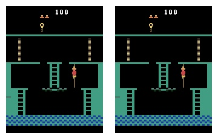

# beating-atari-with-natural-language-guided-rl

This repository is the implementation of the paper **Beating Atari with Natural Language Guided Reinforcement Learning** by Russell Kaplan, Christopher Sauer and Alexander Sosa. [[LINK]](https://arxiv.org/abs/1704.05539)

This project uses OpenAI [Gym](https://gym.openai.com) environment. Most simple games on Gym can be solved simply through DQN or Policy Networks (A2C,A3C) etc. The particular environment we were analyzing is Montezuma Revenge.

You can have a look at the environment [here](https://gym.openai.com/envs/MontezumaRevenge-v0/)

<center>

</center>


### Overview

Montezuma Revenge is of particular interest to us because it is one of the toughest environments on Gym due to it's sparse reward. The agent receives a reward of 1 only when it collects the key.


The aim of the paper was to guide the agent using natural language instructions by providing additional rewards when the agent completes the provided instruction.

### Model Architecture


### Dataset

There was no available dataset for frames and natural language instructions corresponding them. For this we had to play through the game multiple time and save frames along with the best instruction describing the frames. The dataset is a list of `((frame_prev, frame_curr),sentence)` where `frame_prev` and `frame_curr` are consecutive frames and sentence best describes the action happening the pair of frames. The frames are numpy arrays of shape `(210,160,3)`

There are two files `dataset_true.pickle` and `dataset_false.pickle` in `dataset/` directory. The size of `dataset_true` is around 400 frames whereas `dataset_false` have more than 10000 mismatched descriptions.

In order to use these datasets for visualization you need to have `pickle`. Once you have it, you can just load the dataset.

```
with open('dataset/dataset_true.pickle','rb') as file:
	dataset_true = pickle.load(file)
```

### Experiments

We trained the Bimodel Embedding network as mentioned in the paper. Here are few results of similarity between frame pairs and sentences.

| Consecutive Frames | Sentence | Dot Product |
|--------------------|----------|-------------|
|| Climb up the ladder | <p style="color:green">0.9527</p> |
|| Jump to the rope | <p style="color:green">0.8666</p> |
|| Go to the right room | <p style="color:green">0.9167</p> |
|| Climb up the ladder | <p style="color:red">0.1860</p> |
|| Go to the center of the room | <p style="color:red">-0.1225</p> |

There were a lot of other frames in which the model showed false positives. The major reason was that the dataset we had was really small (only 400 true tuples)